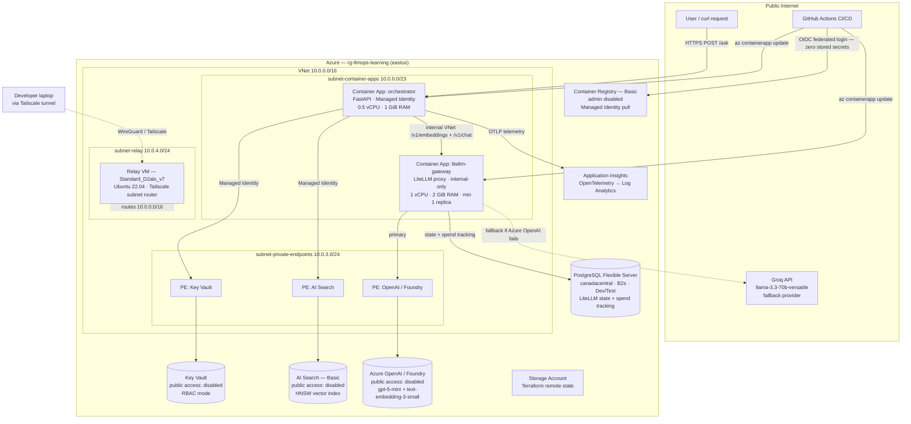
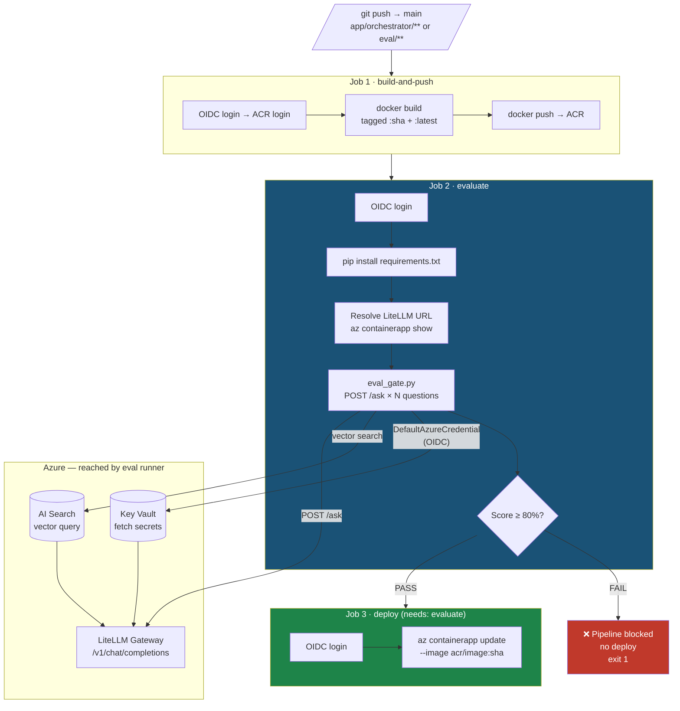

# Azure LLMOps RAG Project

An end-to-end, production-grade Retrieval-Augmented Generation (RAG) system built on Azure, demonstrating LLMOps / AIOps practices for infrastructure architects: infrastructure-as-code, private networking, zero-secret CI/CD, containerized deployment, OpenTelemetry-based observability, multi-provider AI routing with automatic fallback, and per-team cost governance.

---

## Table of Contents

- [What It Does](#what-it-does)
- [Architecture](#architecture)
- [Security Design](#security-design)
- [Tech Stack](#tech-stack)
- [Repository Structure](#repository-structure)
- [Network Topology](#network-topology)
- [Prerequisites](#prerequisites)
- [Deployment Guide](#deployment-guide)
- [Manual Steps (Outside Terraform)](#manual-steps-outside-terraform)
- [Ingestion Pipeline](#ingestion-pipeline)
- [Orchestrator API](#orchestrator-api)
- [LiteLLM Gateway & UI](#litellm-gateway--ui)
- [CI/CD Pipeline](#cicd-pipeline)
- [Observability](#observability)
- [Cost Notes](#cost-notes)
- [Operational Runbook](#operational-runbook)
- [Teardown](#teardown)
- [Design Decisions & Trade-offs](#design-decisions--trade-offs)

---

## What It Does

A user submits a natural-language question via HTTP POST. The orchestrator:

1. Fetches runtime secrets (LiteLLM master key, deployment names) from Azure Key Vault using Managed Identity — no credentials in code or environment variables.
2. Embeds the question by calling the **LiteLLM gateway** (`text-embedding-3-small`) — LiteLLM proxies the request to Azure OpenAI / Foundry using its own credentials, returning a 1536-dimension vector.
3. Executes a **pure vector search** against an **Azure AI Search** index using HNSW (Hierarchical Navigable Small World) approximate nearest-neighbour, retrieving the top-3 most semantically relevant document chunks.
4. Builds a grounded prompt injecting the retrieved context and calls **LiteLLM** (`gpt-5-mini`) with a strict "answer only from context" system instruction. LiteLLM routes the request to Azure OpenAI; if Azure OpenAI is unavailable, it **automatically falls back** to **Groq** (`llama-3.3-70b-versatile`) without any change to the orchestrator.
5. Returns the answer and the list of source documents that were cited.

All AI services, the search index, and Key Vault are locked behind **private endpoints**. The LiteLLM gateway runs as an internal-only Container App (no public ingress) — no AI traffic leaves the Azure VNet.

LiteLLM also exposes a **web UI** (backed by PostgreSQL) for model testing, virtual key management, and **per-team spend tracking** — teams are issued scoped API keys with hard monthly budget caps enforced at the gateway.

---

## Architecture



---

## Security Design

Every backend resource has `public_network_access_enabled = false` (except PostgreSQL — see [Design Decisions](#design-decisions--trade-offs)). The security model has no shared secrets in the data plane:

| Concern | Implementation |
|---|---|
| Container App → Key Vault | User-assigned Managed Identity with `Key Vault Secrets User` RBAC role |
| Container App → AI Search | Same Managed Identity with `Search Index Data Contributor` RBAC role |
| Container App → ACR | Same Managed Identity with `AcrPull` RBAC role (admin credentials disabled) |
| GitHub Actions → Azure | OIDC federated credential — no client secrets, no service principal passwords stored |
| GitHub Actions SP → Key Vault | `Key Vault Secrets User` RBAC — required for the eval gate job to read secrets on the runner |
| GitHub Actions SP → AI Search | `Search Index Data Reader` RBAC — required for the eval gate job to query the index |
| Developer access to private resources | Tailscale subnet router on a relay VM — WireGuard tunnel routes 10.0.0.0/16 through the VNet |
| Key Vault auth mode | RBAC (not vault access policies) — eliminates dual-plane permission confusion |
| Private DNS resolution | Three private DNS zones (`privatelink.vaultcore.azure.net`, `privatelink.search.windows.net`, `privatelink.cognitiveservices.azure.com`) linked to the VNet — all SDK calls resolve to private IPs |
| LiteLLM → Groq (fallback) | Groq API key stored in Key Vault, injected as Container App secret reference — never appears in any tracked file |
| LiteLLM team API keys | Scoped virtual keys issued per team; key tokens hashed in PostgreSQL; master key required to create/revoke |
| PostgreSQL credentials | Auto-generated 32-char alphanumeric password stored in Terraform state (encrypted at rest in Azure Storage) and in Key Vault as `litellm-db-url` |


> **DNS zone note:** Multi-service Azure AI Foundry (Cognitive Services) accounts use `privatelink.cognitiveservices.azure.com`, not `privatelink.openai.azure.com`. The latter applies only to classic single-service Azure OpenAI accounts. Using the wrong zone causes 403 errors from LiteLLM because the SDK resolves the endpoint to a public IP instead of the private one.

---

## Tech Stack

| Layer | Technology | Notes |
|---|---|---|
| Infrastructure as Code | Terraform (`azurerm` ~> 3.100, `azapi` ~> 1.15, `random` ~> 3.5) | Remote state in Azure Storage |
| Compute | Azure Container Apps (Consumption tier) | VNet-integrated environment; `/23` subnet required |
| AI gateway | LiteLLM proxy (`litellm-gateway` Container App) | Internal-only ingress; 1 CPU / 2 GiB / min 1 replica; OpenAI-compatible `/v1` API |
| AI gateway UI | LiteLLM built-in web UI (`/ui`) | Backed by PostgreSQL; team budgets, virtual keys, spend tracking, model playground |
| AI — chat (primary) | Azure OpenAI `gpt-5-mini` via Microsoft Foundry | Global Standard deployment; called via LiteLLM |
| AI — chat (fallback) | Groq `llama-3.3-70b-versatile` | Activated automatically by LiteLLM router if Azure OpenAI fails |
| AI — embeddings | Azure OpenAI `text-embedding-3-small` via Foundry | 1536-dimension vectors; called via LiteLLM |
| Vector store | Azure AI Search — Basic SKU | Basic required for private endpoint; Free tier does not support it |
| Secrets management | Azure Key Vault — Standard SKU | RBAC mode, public access disabled |
| LiteLLM state + spend DB | Azure PostgreSQL Flexible Server — B2s, Canada Central | Dev/Test Burstable tier; stores virtual keys, teams, spend logs; public access with Azure-only firewall |
| CI/CD | GitHub Actions + OIDC federated identity | Zero stored secrets; image tagged with `github.sha` |
| Observability | Application Insights + OpenTelemetry | `azure-monitor-opentelemetry` auto-instruments FastAPI |
| Container registry | Azure Container Registry — Basic SKU | Managed Identity pull, admin disabled |
| Networking | VNet, Private Endpoints, Private DNS Zones, Tailscale | Free VPN alternative to Azure VPN Gateway (~$130/month) |
| App framework | FastAPI + Uvicorn on Python 3.11 | Runs in Docker on Container Apps |
| Vector algorithm | HNSW (`HnswAlgorithmConfiguration`) | Approximate nearest-neighbour; tunable `m`, `efConstruction` |
| Developer VPN | Tailscale (free tier) | Relay VM advertises 10.0.0.0/16 as a subnet router |

---

## Repository Structure

```
azure-llmops-project/
├── .github/
│   └── workflows/
│       ├── deploy.yml              # CI/CD: orchestrator — 3 jobs: build-and-push → evaluate → deploy
│       └── deploy-litellm.yml      # CI/CD: LiteLLM gateway — same pattern, triggers on app/litellm/**
├── eval/
│   ├── questions.json              # Known Q&A pairs with expected keywords for eval gate
│   ├── eval_gate.py                # Eval runner: calls /ask, scores answers, exits 1 if score < 80%
│   └── test_rate_limits.py         # Rate limit smoke test: fires 6 requests, expects 429 after RPM cap
├── app/
│   ├── ingestion/
│   │   ├── ingest.py               # Offline pipeline: chunk → embed → index into AI Search
│   │   └── sample_docs/            # Source documents (.txt, .pdf) for indexing
│   ├── litellm/
│   │   ├── config.yaml             # LiteLLM model list: Azure primary + Groq fallback + router_settings
│   │   └── Dockerfile              # ghcr.io/berriai/litellm:main-latest + config.yaml
│   └── orchestrator/
│       ├── main.py                 # FastAPI app: /health + /ask; calls LiteLLM via LITELLM_INTERNAL_URL
│       ├── orchestrator.py         # Standalone CLI RAG loop (development/testing)
│       ├── Dockerfile              # python:3.11-slim, uvicorn entrypoint on port 8000
│       └── requirements.txt        # Pinned dependencies incl. azure-monitor-opentelemetry
├── scripts/
│   └── setup-github-oidc.sh        # One-shot script: App Registration + SP + OIDC federated credential
└── infra/
    ├── main.tf                     # Resource group, Key Vault, Storage, AI Search, ACR, identities, RBAC
    ├── network.tf                  # VNet, subnets, private endpoints, private DNS zones
    ├── container_apps.tf           # Container Apps Environment (VNet-integrated) + LiteLLM Container App
    ├── postgres.tf                 # PostgreSQL Flexible Server (canadacentral) for LiteLLM state
    ├── relay_vm.tf                 # Tailscale relay VM: cloud-init installs Tailscale, enables IP forwarding
    ├── foundry.tf                  # azapi: chat + embedding model deployments in Foundry account
    ├── secrets.tf                  # azurerm_key_vault_secret: all runtime secrets incl. litellm-db-url (requires VPN)
    ├── variables.tf                # Inputs: location, VNet CIDRs, model names/versions, SSH key, etc.
    ├── outputs.tf                  # Relay VM public IP, orchestrator URL, ACR login server
    ├── providers.tf                # azurerm (~> 3.100) + azapi (~> 1.15) + random (~> 3.5) providers
    └── terraform.tfvars            # ← gitignored; contains sensitive variable values
```

---

## Network Topology

```
10.0.0.0/16  (VNet — eastus)
  ├── 10.0.0.0/23   subnet-container-apps    (Container Apps Environment — needs /23+)
  ├── 10.0.3.0/24   subnet-private-endpoints  (Key Vault PE, AI Search PE, OpenAI PE)
  └── 10.0.4.0/24   subnet-relay              (Tailscale relay VM)

Canada Central (separate region, public access)
  └── llmopslearn-litellmdb.postgres.database.azure.com  (PostgreSQL Flexible Server)
      Firewall: 0.0.0.0/0.0.0.0 — Azure services only (no public internet)
```

The Container Apps subnet requires a `/23` or larger because Azure reserves addresses for the environment's internal load balancer and control plane. Delegated to `Microsoft.App/environments`.

Private DNS zones are VNet-linked so that standard Azure SDK hostnames (e.g. `llmopslearn-kv.vault.azure.net`) resolve to private IPs (`10.0.3.x`) inside the VNet without any code changes.

PostgreSQL runs in Canada Central with public access restricted to Azure-internal IPs only (firewall rule `0.0.0.0–0.0.0.0`). It is not exposed to the internet and is only reachable by Azure services — a practical compromise given that East US quota restrictions prevent provisioning PostgreSQL Flexible Server there.

---

## Prerequisites

- Azure subscription with Owner or Contributor + User Access Administrator roles
- Terraform ≥ 1.5
- Azure CLI (`az`) — authenticated with `az login`
- Docker (for local image builds)
- Tailscale account (free tier) — for developer VPN access
- Groq API key — free at [console.groq.com](https://console.groq.com) — for the chat fallback provider

---

## Deployment Guide

Everything is automated across three phases.

### Phase 1 — Bootstrap Terraform remote state

Terraform cannot manage its own backend, so create the state storage account once before the first apply:

```bash
az group create --name rg-llmops-tfstate --location eastus
az storage account create --name llmopstfstate --resource-group rg-llmops-tfstate \
  --sku Standard_LRS --min-tls-version TLS1_2
az storage container create --name tfstate --account-name llmopstfstate
```

### Phase 2 — Provision infrastructure (no VPN needed)

```bash
cd infra

# Populate terraform.tfvars (gitignored):
cat > terraform.tfvars <<EOF
allowed_ssh_source_ip     = "$(curl -s ifconfig.me)/32"
relay_ssh_public_key      = "$(cat ~/.ssh/id_rsa.pub)"
tailscale_auth_key        = "tskey-auth-XXXX"
foundry_account_name      = "ragmodeldeploy-resource"
chat_model_name           = "gpt-5-mini"
chat_model_version        = "2025-08-07"
chat_deployment_name      = "gpt-5-mini"
embedding_model_name      = "text-embedding-3-small"
embedding_model_version   = "1"
embedding_deployment_name = "text-embedding-3-small"
github_org                = "gvreddylab"
github_repo               = "azure-llmops-project"
EOF

terraform init   # downloads azurerm + azapi + random providers
terraform plan -out=tfplan
terraform apply tfplan
```

**What this apply creates:**
- Resource group, Key Vault (private, RBAC), AI Search (private), ACR, App Insights, Storage
- User-assigned Managed Identity + all RBAC assignments
- VNet + 3 subnets + 3 private endpoints + 3 private DNS zones
- Tailscale relay VM (Ubuntu 22.04) with cloud-init (installs Tailscale, enables IP forwarding)
- **Foundry model deployments** (`gpt-5-mini` + `text-embedding-3-small`) via `azapi_resource`
- **PostgreSQL Flexible Server** in Canada Central (B2s, Dev/Test) for LiteLLM state

> **Note:** If Foundry models were already deployed manually, run `terraform import azapi_resource.chat_deployment <resource-id>` to bring them under management without recreating.

### Phase 3 — Connect VPN, populate Key Vault secrets

Key Vault has `public_network_access_enabled = false`. The `azurerm` provider must reach the KV data plane from inside the Tailscale tunnel.

```bash
# 1. Approve the subnet router in Tailscale admin console:
#    Machines → your relay VM → Approve routes → 10.0.0.0/16

# 2. Connect your laptop to Tailscale:
tailscale up

# 3. Verify VPN is routing the private range:
curl -s -o /dev/null -w "%{http_code}" https://llmopslearn-kv.vault.azure.net/
# Expected: 401 (reached KV, denied auth) — not a TCP connection error

# 4. Apply the secrets:
cd infra && terraform apply
```

Terraform creates these Key Vault secrets automatically:

| Secret name | Source |
|---|---|
| `foundry-endpoint` | `data.azurerm_cognitive_account.foundry.endpoint` |
| `foundry-api-key` | `data.azurerm_cognitive_account.foundry.primary_access_key` |
| `chat-deployment-name` | `var.chat_deployment_name` |
| `embedding-deployment-name` | `var.embedding_deployment_name` |
| `appinsights-connection-string` | `azurerm_application_insights.llmops.connection_string` |
| `litellm-db-url` | `postgresql://litellmadmin:<generated>@<fqdn>:5432/litellm?sslmode=require` |

Two secrets must be set manually — they are user-generated values with no Terraform source:

```bash
# LiteLLM master key (used by orchestrator and LiteLLM container):
az keyvault secret set \
  --vault-name llmopslearn-kv \
  --name litellm-master-key \
  --value "$(openssl rand -hex 32)"

# Groq API key (for chat fallback — get from console.groq.com):
az keyvault secret set \
  --vault-name llmopslearn-kv \
  --name groq-api-key \
  --value "gsk_<your-groq-key>"
```

### Wire up GitHub Actions OIDC

```bash
./scripts/setup-github-oidc.sh \
  --org  gvreddylab \
  --repo azure-llmops-project \
  --resource-group rg-llmops-learning \
  --acr  llmopslearnacr
```

### Ingest documents

```bash
cd app/ingestion
python3 -m venv venv && source venv/bin/activate
pip install -r requirements.txt

# Place .txt or .pdf files in sample_docs/ then:
python ingest.py
```

---

## Manual Steps (Outside Terraform)

| Step | Why manual | Command |
|---|---|---|
| Create Foundry AI Services account | Requires portal/AI Studio — no ARM resource type | `ai.azure.com → Create project` |
| Set `litellm-master-key` in KV | User-generated random value; no Terraform source | `az keyvault secret set ...` (see Phase 3) |
| Set `groq-api-key` in KV | External credential; rotate at console.groq.com | `az keyvault secret set ...` (see Phase 3) |
| Create LiteLLM teams + virtual keys | One-time setup via LiteLLM API or UI | See [LiteLLM Gateway & UI](#litellm-gateway--ui) |

---

## Ingestion Pipeline

`app/ingestion/ingest.py` is an offline, run-once (or re-run on content change) script — not a deployed service.

**Flow:**
```
local files (.txt, .pdf)
  → load_documents()           reads text; PdfReader for PDFs
  → chunk_text()               fixed 500-char windows (no overlap)
  → embed_text()               text-embedding-3-small → 1536-dim float vector
  → ensure_index_exists()      idempotent: creates HNSW index if absent
  → search_client.upload_documents()  batch upload to AI Search
```

**Index schema:**

| Field | Type | Role |
|---|---|---|
| `id` | `String` (key) | Sequential integer as string |
| `content` | `String` (searchable) | Raw chunk text |
| `source_file` | `String` (filterable) | Original filename |
| `content_vector` | `Collection(Single)` | 1536-dim embedding, HNSW profile |

---

## Orchestrator API

### Endpoints

| Method | Path | Description |
|---|---|---|
| `GET` | `/health` | Liveness probe — returns `{"status": "ok"}` |
| `POST` | `/ask` | RAG query — accepts `{"question": "..."}` |

### Example

```bash
curl -X POST https://llmops-orchestrator.politemeadow-6d983eb5.eastus.azurecontainerapps.io/ask \
  -H "Content-Type: application/json" \
  -d '{"question": "What are the required skills for an Infrastructure Architect?"}'
```

```json
{
  "answer": "The required skills include...",
  "sources": ["Infrastructure Architect JD.pdf"]
}
```

### RAG parameters

| Parameter | Value | Location |
|---|---|---|
| Embedding model | `text-embedding-3-small` | Key Vault secret |
| Chat model | `gpt-5-mini` | Key Vault secret |
| LiteLLM base URL | `https://{LITELLM_INTERNAL_URL}/v1` | Container App env var |
| LiteLLM auth | `litellm-master-key` from Key Vault | OpenAI SDK `api_key=` |
| Top-K chunks | 3 | `main.py` constant `TOP_K` |
| Fallback (automatic) | Groq `llama-3.3-70b-versatile` | LiteLLM `router_settings.fallbacks` |

---

## LiteLLM Gateway & UI

### What LiteLLM is and why it exists

LiteLLM is an open-source proxy that presents a single **OpenAI-compatible REST API** (`/v1/chat/completions`, `/v1/embeddings`) to callers, while translating requests behind the scenes to any AI provider — Azure OpenAI, Groq, Anthropic, Bedrock, Vertex AI, etc. The orchestrator makes standard OpenAI SDK calls and has no knowledge of which underlying provider is serving them.

```
Orchestrator (FastAPI)
  │
  │  POST /v1/chat/completions  {"model": "gpt-5-mini", ...}
  │  Authorization: Bearer <litellm-master-key>
  ▼
LiteLLM Gateway  (litellm-gateway Container App — internal VNet only)
  │   ┌──────────────────────────────────────────────────────────────┐
  │   │ config.yaml                                                   │
  │   │  model_list:                                                  │
  │   │    gpt-5-mini  →  azure/gpt-5-mini (primary)                 │
  │   │    gpt-5-mini  →  groq/llama-3.3-70b-versatile (fallback)   │
  │   │    text-embedding-3-small  →  azure/text-embedding-3-small   │
  │   └──────────────────────────────────────────────────────────────┘
  │
  ├──► Azure OpenAI / Foundry  (primary — private endpoint in VNet)
  │      model: azure/gpt-5-mini
  │      api_key: AZURE_OPENAI_API_KEY (from Key Vault, not in code)
  │
  └──► Groq API  (fallback — public internet, only if Azure OAI fails)
         model: groq/llama-3.3-70b-versatile
         api_key: GROQ_API_KEY (from Key Vault)
```

**What LiteLLM does in this project:**

| Capability | How it's used |
|---|---|
| **Provider abstraction** | Orchestrator calls OpenAI SDK; LiteLLM translates to Azure OpenAI's custom `api_base` + `api_version` format |
| **Automatic fallback** | `router_settings.fallbacks` — if Azure OpenAI returns 5xx or times out, LiteLLM retries the same request on Groq with no orchestrator change |
| **Credential isolation** | All AI provider keys (Azure OpenAI key, Groq key) live only in LiteLLM's environment, injected from Key Vault — the orchestrator has no AI provider credentials |
| **Virtual key management** | Issues `sk-` prefixed API keys scoped to teams; every request logs model, tokens, cost, and latency against that key |
| **Team budget enforcement** | Per-team monthly spend caps; returns HTTP 429 when a team exceeds their limit |
| **Admin UI** | `/ui` — web dashboard backed by PostgreSQL for model playground, key CRUD, spend analytics, and latency charts |
| **Internal-only ingress** | Runs with no public ingress; only reachable from other Container Apps in the same VNet environment — AI traffic never leaves Azure |

**Request flow through LiteLLM:**

```
1. Orchestrator sends:
   POST https://litellm-gateway.internal.<env>/v1/chat/completions
   {"model": "gpt-5-mini", "messages": [...]}

2. LiteLLM authenticates the request against the master key (or team virtual key)

3. LiteLLM looks up "gpt-5-mini" in config.yaml → maps to azure/gpt-5-mini

4. LiteLLM rewrites the request:
   POST https://ragmodeldeploy-resource.cognitiveservices.azure.com/
        openai/deployments/gpt-5-mini/chat/completions?api-version=2024-10-21
   api-key: <Azure OpenAI key from env>

5. If Azure OpenAI returns an error → LiteLLM immediately retries
   against groq/llama-3.3-70b-versatile (Groq's public API)

6. Response is translated back to standard OpenAI response format
   and returned to the orchestrator — identical structure regardless of provider

7. LiteLLM logs: team_id, model, input_tokens, output_tokens, cost_usd, latency_ms → PostgreSQL
```

### Model routing


**RPM/TPM limits — how they work in LiteLLM:**

| Limit type | Where set | Effect |
|---|---|---|
| `rpm` / `tpm` in `litellm_params` | Per model deployment in `config.yaml` | Sets deployment capacity for **router load balancing** — router avoids sending to an overloaded deployment |
| `rpm` / `tpm` on a virtual key | Via `/key/generate` API or UI | **Hard enforcement** — returns HTTP 429 after the limit is hit for that key |

For per-team hard rate caps, create keys with limits via the LiteLLM UI → **Keys** → **Create Key**, or via the API:
```bash
curl -X POST "${BASE}/key/generate" \
  -H "Authorization: Bearer ${LITELLM_MASTER}" \
  -H "Content-Type: application/json" \
  -d '{"team_id": "<id>", "rpm": 100, "tpm": 50000}'
```

### Accessing the UI

The UI is backed by PostgreSQL (virtual keys, teams, and spend logs persist across restarts).

**Expose externally** (internal-only by default — toggle when needed):
```bash
# Make external:
az containerapp ingress update \
  --name litellm-gateway --resource-group rg-llmops-learning \
  --type external --target-port 4000

# Revert to internal when done:
az containerapp ingress update \
  --name litellm-gateway --resource-group rg-llmops-learning \
  --type internal --target-port 4000
```

**URL:** `https://litellm-gateway.politemeadow-6d983eb5.eastus.azurecontainerapps.io/ui`

**Login:**
- Username: `admin`
- Password: `az keyvault secret show --vault-name llmopslearn-kv --name litellm-master-key --query value -o tsv`

### Team-based cost governance

Two teams are provisioned with $50/month budget caps. When a team's spend reaches the cap, their key returns HTTP 429 until the budget resets on the 1st of each month.

| Team | Team ID | Monthly budget | Budget resets |
|---|---|---|---|
| risk-team | `5a73732c-abfd-43ba-a0d4-9336e805ca8e` | $50 | 1st of month |
| business-team | `f51b088e-b28b-46d6-90c5-a1f6015b9e6c` | $50 | 1st of month |

Each team has a dedicated virtual API key. Distribute these keys to the respective team — they use them as a standard `Authorization: Bearer <key>` header against LiteLLM's `/v1` API. The orchestrator continues using the master key; teams use scoped keys for direct LiteLLM access.

**Create a new team:**
```bash
LITELLM_MASTER=$(az keyvault secret show --vault-name llmopslearn-kv --name litellm-master-key --query value -o tsv)
BASE="https://litellm-gateway.politemeadow-6d983eb5.eastus.azurecontainerapps.io"

curl -X POST "${BASE}/team/new" \
  -H "Authorization: Bearer ${LITELLM_MASTER}" \
  -H "Content-Type: application/json" \
  -d '{
    "team_alias": "new-team",
    "max_budget": 100,
    "budget_duration": "1mo",
    "models": ["gpt-5-mini", "text-embedding-3-small"]
  }'
```

**Generate a team API key:**
```bash
curl -X POST "${BASE}/key/generate" \
  -H "Authorization: Bearer ${LITELLM_MASTER}" \
  -H "Content-Type: application/json" \
  -d '{"team_id": "<team-id>", "key_alias": "team-app-key", "max_budget": 100, "budget_duration": "1mo"}'
# Returns: {"key": "sk-...", ...}  — distribute this key to the team
```

**Update a team's budget:**
```bash
curl -X POST "${BASE}/team/update" \
  -H "Authorization: Bearer ${LITELLM_MASTER}" \
  -H "Content-Type: application/json" \
  -d '{"team_id": "<team-id>", "max_budget": 200}'
```

**Check team spend:**
```bash
curl "${BASE}/team/info?team_id=<team-id>" \
  -H "Authorization: Bearer ${LITELLM_MASTER}" \
  | python3 -c "import sys,json; t=json.load(sys.stdin)['team_info']; print(f'\${t[\"spend\"]:.4f} / \${t[\"max_budget\"]}')"
```

**What the UI tracks per team:**
- USD spend (live vs monthly cap)
- Token usage — input + output tokens per request
- Request count — broken down by model
- Latency — p50 / p95 / p99 response times
- Model breakdown — what fraction of spend went to Azure OpenAI vs Groq fallback

---

## CI/CD Pipeline

Two independent workflows, each scoped to its own app directory.

### Orchestrator (`deploy.yml`)
Triggers on pushes to `main` that modify `app/orchestrator/**` or `eval/**`.

**Three-job pipeline with eval gate:**



| Job | What it does |
|---|---|
| `build-and-push` | OIDC login → ACR login → `docker build` → push both `:sha` and `:latest` tags |
| `evaluate` | Install Python deps on runner → resolve LiteLLM URL → run `eval/eval_gate.py` against live Key Vault + Search + LiteLLM — exits 1 if answer quality < 80% |
| `deploy` | `az containerapp update --image ...:sha` — only runs if `evaluate` passes |

The `deploy` job is skipped automatically by GitHub Actions if `evaluate` exits non-zero — no explicit `if:` condition needed.

**Eval gate — `eval/eval_gate.py`:**
- Reads `eval/questions.json` (known Q&A pairs with expected keywords)
- POSTs each question to the real LiteLLM `/v1/chat/completions` via Azure Search + Key Vault (uses OIDC credentials already on the runner)
- Checks that expected keywords appear in the answer
- Passes if ≥ 80% of questions score correctly (override with `EVAL_PASS_THRESHOLD` env var)
- No mocking — tests the real retrieval + generation pipeline

**RBAC required for the eval job** (one-time setup — the GitHub Actions service principal needs these in addition to ACR + Container App permissions):

```bash
SP_OID="220ec55f-1046-4316-8dd7-b265a78c4e2c"   # GitHub Actions SP object ID

az role assignment create --role "Key Vault Secrets User" \
  --assignee-object-id $SP_OID --assignee-principal-type ServicePrincipal \
  --scope $(az keyvault show --name llmopslearn-kv --resource-group rg-llmops-learning --query id -o tsv)

az role assignment create --role "Search Index Data Reader" \
  --assignee-object-id $SP_OID --assignee-principal-type ServicePrincipal \
  --scope $(az search service show --name llmopslearn-search --resource-group rg-llmops-learning --query id -o tsv)
```

### LiteLLM gateway (`deploy-litellm.yml`)
Triggers on pushes to `main` that modify `app/litellm/**`. Deploys the `litellm-gateway` Container App.

### Shared steps (both workflows)

1. **OIDC login** — `azure/login@v2` exchanges a GitHub-signed JWT for an Azure access token.
2. **ACR login** — `az acr login` using the OIDC-authenticated session.
3. **Build** — `docker build` tagged with both `github.sha` (immutable) and `latest`.
4. **Push** — both tags pushed to ACR.
5. **Deploy** — `az containerapp update --image <acr>/<image>:<sha>` — pinned to commit SHA.

**Terraform + CI/CD coexistence:** Both Container Apps have `lifecycle { ignore_changes = [template[0].container[0].image] }` in Terraform. This means `terraform apply` manages infrastructure (env vars, secrets, scaling, ingress) but never resets the CI/CD-deployed image back to the `:v1` placeholder.

**Zero secrets:** Both workflow files contain no credentials. The three GitHub repository secrets (`AZURE_CLIENT_ID`, `AZURE_TENANT_ID`, `AZURE_SUBSCRIPTION_ID`) are non-sensitive identifiers, not passwords.

---

## Observability

The orchestrator uses `azure-monitor-opentelemetry` for automatic instrumentation:

```python
configure_azure_monitor(connection_string=<from Key Vault>)
FastAPIInstrumentor.instrument_app(app)
```

**Application Insights queries:**

| Signal | Query |
|---|---|
| Request latency | `requests \| summarize avg(duration) by bin(timestamp, 5m)` |
| Failed requests | `requests \| where success == false` |
| Dependency calls (LiteLLM, Search) | `dependencies \| where type == "HTTP"` |
| Application logs | `traces \| where message contains "Retrieved"` |
| Live metrics | Application Insights → Live Metrics |

**LiteLLM UI metrics** (per-team, per-model):
- Token usage, spend, latency, request count — visible in the `/ui` dashboard
- Spend alerts fire at the team budget cap (HTTP 429 enforcement)

---

## Cost Notes

| Resource | SKU | Estimated cost | Notes |
|---|---|---|---|
| Azure AI Search | Basic | ~$75/month | Required for private endpoint — Free tier lacks PE support |
| Relay VM | Standard_D2als_v7 | ~$58/month | Deallocate when VPN not needed |
| PostgreSQL Flexible Server | B2s, Canada Central | ~$30/month | Dev/Test Burstable; LiteLLM state + spend DB |
| Container Apps — LiteLLM | 1 vCPU · 2 GiB · 1 min replica | ~$35/month | Always-on (min_replicas=1) to avoid cold starts |
| Container Apps — Orchestrator | 0.5 vCPU · 1 GiB · scale-to-zero | Near zero at rest | Billed per vCPU-second of active requests |
| Key Vault | Standard | < $1/month | Per-operation pricing |
| Application Insights | Pay-as-you-go | < $5/month | Depends on ingestion volume |
| Storage Account | Standard LRS | < $1/month | Terraform state + blob container |
| ACR | Basic | < $5/month | Storage + egress |
| Azure OpenAI (Foundry) | Pay-per-token | Varies | `gpt-5-mini` is cost-efficient |
| Groq | Pay-per-token | Near zero | Only charges when Azure OpenAI falls back |

**Cost control:**

```bash
# Deallocate relay VM when not using VPN:
az vm deallocate --name llmopslearn-relay-vm --resource-group rg-llmops-learning

# Restart when needed:
az vm start --name llmopslearn-relay-vm --resource-group rg-llmops-learning

# Scale LiteLLM to zero when project is idle (removes the ~$35/month always-on cost):
az containerapp update --name litellm-gateway --resource-group rg-llmops-learning \
  --min-replicas 0 --max-replicas 1
# Revert: --min-replicas 1
```

---

## Operational Runbook

### Check orchestrator logs
```bash
az containerapp logs show --name llmops-orchestrator \
  --resource-group rg-llmops-learning --follow
```

### Check LiteLLM gateway logs
```bash
az containerapp logs show --name litellm-gateway \
  --resource-group rg-llmops-learning --follow
```

### Verify all three LiteLLM models are healthy
```bash
MASTER=$(az keyvault secret show --vault-name llmopslearn-kv --name litellm-master-key --query value -o tsv)
# Expose externally first if not already, then:
curl -s https://litellm-gateway.politemeadow-6d983eb5.eastus.azurecontainerapps.io/health \
  -H "Authorization: Bearer ${MASTER}" | python3 -m json.tool
# Expected: healthy_count=3, unhealthy_count=0
```

### Check team spend
```bash
MASTER=$(az keyvault secret show --vault-name llmopslearn-kv --name litellm-master-key --query value -o tsv)
BASE="https://litellm-gateway.politemeadow-6d983eb5.eastus.azurecontainerapps.io"

for TEAM_ID in 5a73732c-abfd-43ba-a0d4-9336e805ca8e f51b088e-b28b-46d6-90c5-a1f6015b9e6c; do
  curl -s "${BASE}/team/info?team_id=${TEAM_ID}" \
    -H "Authorization: Bearer ${MASTER}" \
    | python3 -c "import sys,json; t=json.load(sys.stdin)['team_info']; print(t['team_alias'], f'\${t[\"spend\"]:.4f}/\${t[\"max_budget\"]}')"
done
```

### Access LiteLLM UI
```bash
# Expose externally (toggle — revert when done):
az containerapp ingress update --name litellm-gateway \
  --resource-group rg-llmops-learning --type external --target-port 4000

# Open in browser:
echo "https://litellm-gateway.politemeadow-6d983eb5.eastus.azurecontainerapps.io/ui"
# Login: admin / <litellm-master-key from KV>

# Revert to internal when done:
az containerapp ingress update --name litellm-gateway \
  --resource-group rg-llmops-learning --type internal --target-port 4000
```

### Roll back to a specific commit
```bash
az containerapp update --name llmops-orchestrator \
  --resource-group rg-llmops-learning \
  --image llmopslearnacr.azurecr.io/llmops-orchestrator:<git-sha>
```

### Re-index documents
```bash
cd app/ingestion && source venv/bin/activate
python ingest.py
```

### Verify private endpoint DNS resolution (from relay VM or VPN)
```bash
# Should resolve to 10.0.3.x, not a public IP:
nslookup llmopslearn-kv.vault.azure.net
nslookup llmopslearn-search.search.windows.net
nslookup ragmodeldeploy-resource.cognitiveservices.azure.com
```

### Rotate Groq API key
```bash
# 1. Rotate at console.groq.com, then update KV:
az keyvault secret set --vault-name llmopslearn-kv --name groq-api-key --value "gsk_<new-key>"

# 2. Restart LiteLLM to pick up the new secret:
az containerapp revision restart --name litellm-gateway \
  --resource-group rg-llmops-learning \
  --revision "$(az containerapp show --name litellm-gateway \
    --resource-group rg-llmops-learning \
    --query properties.latestRevisionName -o tsv)"
```

---

## Teardown

```bash
cd infra && terraform destroy
```

Clean up manually created resources:

```bash
# Delete the GitHub Actions App Registration:
APP_ID=$(az ad app list --display-name "llmops-github-actions" --query "[0].appId" -o tsv)
az ad app delete --id $APP_ID

# Delete the Foundry / Cognitive Services account:
az cognitiveservices account delete \
  --name ragmodeldeploy-resource --resource-group rg-llmops-learning

# Delete Terraform state storage:
az group delete --name rg-llmops-tfstate --yes
```

---

## Design Decisions & Trade-offs

**Tailscale vs Azure VPN Gateway**
Tailscale on a $58/month VM is used instead of Azure VPN Gateway (~$130/month + egress). The relay VM is a subnet router (`--advertise-routes=10.0.0.0/16`) — WireGuard tunnels traffic from the developer laptop into the VNet. The trade-off: the relay VM is a single point of failure for VPN access, and its uptime is not critical since it only serves developers, not the application.

**AI Search Basic over Free**
Free tier does not support private endpoints. Basic is the minimum SKU that does. This is the largest fixed cost at ~$75/month.

**HNSW pure-vector search (no hybrid)**
`search_text=None` disables BM25 keyword matching. Pure vector search is sufficient for semantic retrieval of this document set. Hybrid (keyword + vector) would be trivial to add for harder recall tasks.

**Fixed-size chunking (500 chars, no overlap)**
Simple and predictable. Semantic/recursive chunking with overlap would improve retrieval quality at the cost of more complex ingestion logic and higher embedding cost.

**User-assigned Managed Identity**
Preferred over system-assigned because it persists independently of the Container App lifecycle. If the Container App is deleted and recreated during Terraform destroy/apply cycles, the same identity and RBAC assignments are preserved.

**RBAC mode on Key Vault**
Chosen over vault access policies. RBAC centralises all Azure permission management in IAM. `Key Vault Secrets User` is the minimum role needed for `SecretClient.get_secret()`.

**`github.sha` image tags in CI/CD**
Every deployment is tagged with the exact commit SHA. Rollbacks are unambiguous (`az containerapp update --image ...:abc1234`) and the deployment history is auditable via ACR.

**Two-phase `terraform apply` for private Key Vault**
Phase 1 (infra + relay VM + private endpoints) runs without VPN; Phase 2 (KV secrets) runs after connecting the Tailscale tunnel. This enforces that secrets can only be written by someone who already has network-level access to the private environment.

**`azapi` for Foundry model deployments**
The `azurerm` provider has no stable resource for `Microsoft.CognitiveServices/accounts/deployments`. The `azapi` provider calls the ARM REST API directly with a pinned API version (`2024-06-01-preview`). `lifecycle { ignore_changes = [body] }` prevents Terraform from re-PUTting imported deployments on every apply.

**LiteLLM as an AI gateway**
The orchestrator calls LiteLLM's OpenAI-compatible `/v1` API rather than Azure OpenAI directly. This decouples the application from the underlying provider — swapping models or adding fallbacks requires only a `config.yaml` change, not an orchestrator code change. It also enables team-level budget enforcement, virtual key management, and centralised token/spend logging. The trade-off is one extra network hop inside the VNet (sub-millisecond) and one additional service to operate.

**Groq as a fallback provider**
LiteLLM's `router_settings.fallbacks` automatically routes `gpt-5-mini` requests to `groq/llama-3.3-70b-versatile` if Azure OpenAI fails. The Groq API key is stored only in Key Vault (`groq-api-key`) and injected as a Container App secret reference — it never appears in any tracked file. There is no embedding fallback because Groq does not offer embedding models.

**LiteLLM 1 vCPU / 2 GiB / min_replicas=1**
The original 0.5 vCPU / 1 GiB configuration caused OOM kills (exit code 137) on cold starts — the `ghcr.io/berriai/litellm:main-latest` image is large and imports many packages. 2 GiB is stable. `min_replicas=1` keeps the container always warm, eliminating cold-start failures that would block the orchestrator. The cost is ~$35/month of idle compute, which is acceptable given that LiteLLM is on the critical path for every RAG query.

**`lifecycle { ignore_changes = [template[0].container[0].image] }` on Container Apps**
Terraform's in-code image reference is a `:v1` placeholder. Without this lifecycle rule, every `terraform apply` resets the Container App to that placeholder, wiping out the CI/CD-deployed SHA-tagged image. The rule lets Terraform own all infrastructure concerns (env vars, secrets, scaling, ingress) while CI/CD owns the image tag.

**`ingress[0].fqdn` vs `latest_revision_fqdn` for LiteLLM URL**
`ingress[0].fqdn` is the stable internal hostname (e.g. `litellm-gateway.internal.<env-id>.eastus.azurecontainerapps.io`). `latest_revision_fqdn` includes a revision suffix that changes with every deployment. Using the stable URL means the orchestrator's `LITELLM_INTERNAL_URL` never needs updating after a LiteLLM CI/CD run.

**`privatelink.cognitiveservices.azure.com` DNS zone**
Multi-service Azure AI Foundry accounts expose endpoints under `*.cognitiveservices.azure.com`, not `*.openai.azure.com`. Using the wrong private DNS zone (`privatelink.openai.azure.com`) causes all LiteLLM → Azure OpenAI calls to resolve to the public IP and fail with 403. Classic single-service Azure OpenAI accounts use the openai zone — this project uses a multi-service Cognitive Services account.

**PostgreSQL in Canada Central, not East US**
East US and East US 2 have subscription-level quota restrictions on PostgreSQL Flexible Server for this subscription. Canada Central is the geographically closest unrestricted region (< 5 ms over Azure backbone). PostgreSQL is a metadata-only workload for LiteLLM (virtual keys, spend logs) — latency to the database is not on the user-facing critical path.

**PostgreSQL public access (Azure-only firewall)**
The PostgreSQL Flexible Server uses public access restricted by the `0.0.0.0/0.0.0.0` firewall rule (Azure magic: allows only Azure-internal IPs, not the public internet). VNet integration was the first choice but conflicts with the East US quota restriction — Flexible Server VNet integration requires a delegated subnet in the same region as the server, and creating that server in Canada Central while the VNet is in East US would require cross-region VNet peering. The public-access-with-Azure-firewall pattern is a well-understood Azure pattern used widely for internal-only services.
